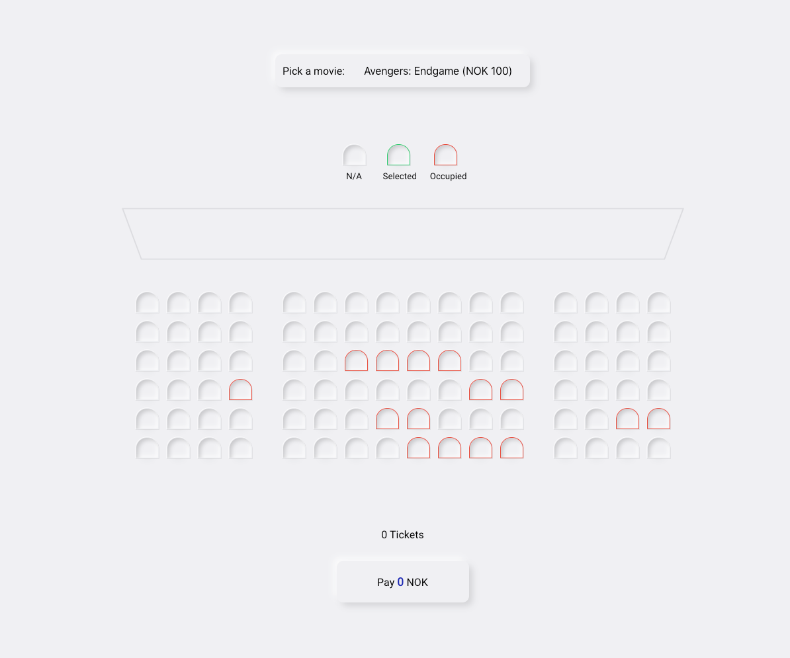

# Vanilla JavaScript Project 002

## Movie Seat Booking
Display movie choices and seats in a cinema to select from in order to purchase tickets.

## Project Specifications

- Display UI with movie select, screen, seats, legend & seat info
- User can select a movie/price
- User can select/deselect seats
- User can not select occupied seats
- Number of seats and price will update
- Save seats, movie and price to local storage so that UI is still populated on refresh

## Step by step building process:

### Step 1 - HTML STRUCTURE

Just a lots of div's

### Step 2 - CSS STYLE

For most part its pretty basic SCSS, I chose for this project neomorphism design.

```scss
// to change shape of screen
.container{
        perspective: 1000px;
}
```


<h2 align="center">
  
</h2>

### Step 3 - JavaScript

Selecting Movie and seats from UI

### Step 4 - JavaScript

Save data to local storage

### Step 5 - JavaScript

Populate UI with saved data. I was able to save everything to local storage and then populate UI that gets called